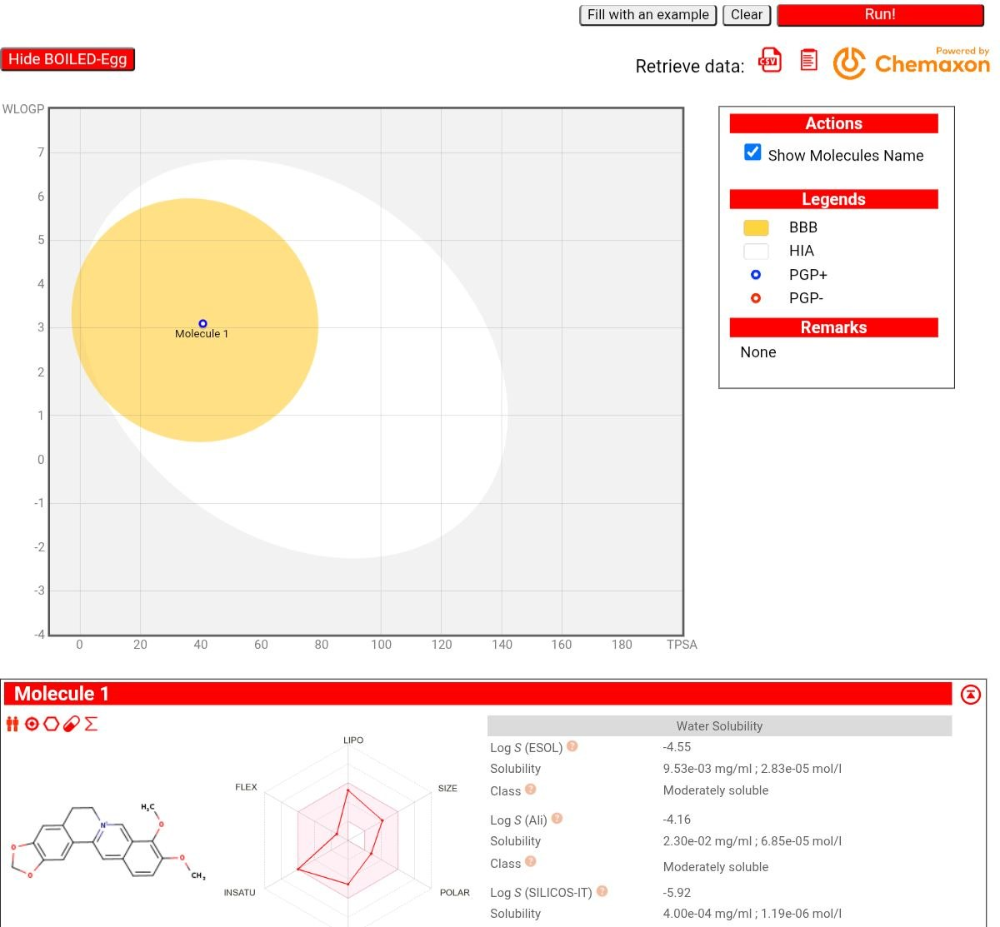

# 🧬 GlucoCard  
### Computational Drug Screening & Analysis Pipeline

---

## 📍 Overview
GlucoCard is a Python-based computational pipeline designed to explore drug screening and analysis for potential Type-2 Diabetes inhibitors.

The project integrates rule-based evaluation with real molecular data to understand how computational approaches can assist in early-stage drug discovery.

---

## 🫧 Pipeline Workflow

### 🔹 Data Acquisition
- Automated retrieval of molecular data using PubChemPy  
- Extraction of molecular weight, H-bond donors, and acceptors  

### 🔹 Drug-Likeness Screening
- Applied Lipinski-inspired rules  
- Evaluated physicochemical suitability of compounds  

### 🔹 Comparative Analysis
- Compared multiple drug candidates  
- Generated ranking and recommendations  

### 🔹 Bioavailability Concept (Exploratory)
- Studied BOILED-Egg model using SwissADME  
- Understood GI absorption and drug-likeness concepts  

---

## 🌐 Case Study Molecules
- Berberine  
- Acarbose  
## 📸 Project Visuals

### BOILED-Egg Analysis (SwissADME)



### Target Protein Structure


---

## 📝 Key Observations:

- Berberine showed favorable drug-likeness properties  
- Acarbose exceeded some Lipinski thresholds  
- Computational screening helps in early filtering of drug candidates

* **[Click here to view the Screening Output Log (output_log.txt)](./output_log.txt)**


---

##● Note: 
This project is a **rule-based and exploratory computational model**.  
Docking and binding affinity analysis were studied conceptually and not fully implemented.

---

## 🧪 Technologies Used
- Python  
- PubChemPy  
- SwissADME (conceptual use)  

---

## 🔮 Future Scope
- Molecular docking integration (AutoDock Vina)  
- Machine learning-based prediction models  
- ADMET property analysis  
- Expansion to larger compound datasets  

---

## Author
Thrishitha Reddy

---

## Installation & Usage

### 1. Clone the repository

```bash
git clone https://github.com/thrishithareddy11/Project-Glucocard.git
```

### 2. Install the required package

```bash
pip install -r requirements.txt
```

### 3. Run the project

```bash
python Glucocard_discovery.py
```